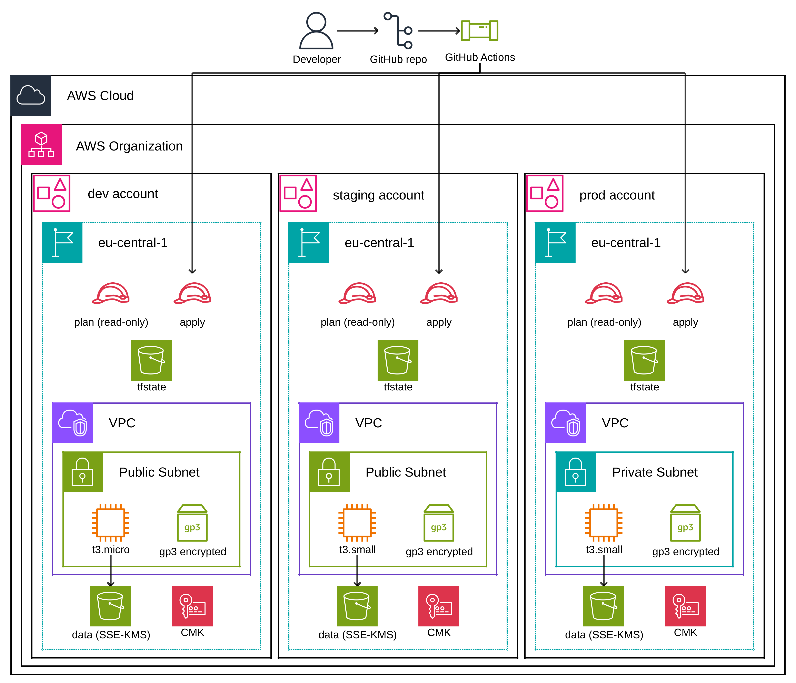
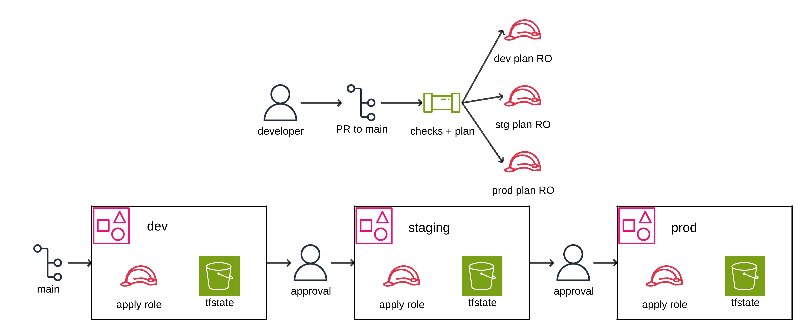

# Infrastructure - Terraform + GitHub Actions

Infrastructure-as-Code for the AWS footprint, with a controlled promotion path
`dev → staging → prod`.

The infrastructure itself is deliberately small (one secure S3 bucket, one EC2
instance). The point of this repository is the *structure* around it: module
reuse, environment isolation, and a deployment flow that makes accidental
production changes hard.



Three accounts under one Organization, each with its own state, its own
Terraform roles, and one copy of the stack. Promotion between them:



Both are generated from YAML in `docs/` - see `docs/README.md`.

---

## 1. Repository structure

```
.
├── modules/                    # Reusable, environment-agnostic building blocks
│   ├── secure-bucket/          # Hardened S3 bucket (KMS, TLS-only, no public access)
│   ├── compute/                # EC2 instance (SSM-managed, no SSH, encrypted EBS)
│   └── app-stack/              # Opinionated composition: bucket + compute + IAM wiring
│
├── envs/                       # One Terraform root per environment = one state file
│   ├── dev/
│   ├── staging/
│   └── prod/
│
├── .github/
│   ├── workflows/
│   │   ├── terraform-plan.yml      # PR: fmt, validate, tflint, trivy, plan
│   │   ├── terraform-deploy.yml    # main: orchestrates dev → staging → prod
│   │   ├── _terraform-apply.yml    # reusable apply job, called per stage
│   │   ├── terraform-destroy.yml   # manual, dev/staging only, typed confirmation
│   │   └── terraform-drift.yml     # scheduled: detect out-of-band changes
│   ├── CODEOWNERS
│   └── pull_request_template.md
│
├── bootstrap/                  # One-time per account: state bucket, OIDC provider, roles
├── docs/                       # Diagram-as-code sources and rendered PNGs
├── .tflint.hcl
├── .trivyignore.yaml           # accepted findings, each with a stated reason
└── Makefile                    # Local convenience wrappers
```

### Why `modules/` + `envs/` and not workspaces

Terraform workspaces share one backend key prefix, one provider configuration
and one set of variables. That makes it easy to `apply` into production while
believing you are in dev, and it makes per-environment divergence (different
account, different instance size, different retention) awkward.

A root module per environment gives:

- a **separate state file** (and, in a real setup, a separate AWS account),
- a **separate provider/role assumption** per environment,
- an explicit, reviewable diff when an environment drifts from its siblings.

The cost is some duplication in `envs/*/main.tf`. That duplication is
intentional and small - the logic lives in `modules/`, the roots only wire
values in.

---

## 2. Environment isolation

| Concern | Mechanism |
|---|---|
| State | Separate S3 backend key per env: `env/<env>/terraform.tfstate`, in a separate state bucket per account. Locking via S3 conditional writes (`use_lockfile`). |
| Credentials | GitHub OIDC → one IAM role per environment. No long-lived access keys. The dev role cannot touch prod. |
| Config | `envs/<env>/terraform.tfvars`, auto-loaded. No shared mutable globals. |
| Account IDs | Never committed. Supplied as `TF_VAR_account_id`, from a per-environment GitHub secret in CI or an exported variable locally. The same value names the state bucket, which is why the backend is a partial configuration. |
| Naming | Every resource is prefixed `${var.project}-${var.environment}-...` and tagged via `default_tags`. |
| Blast radius | Prod lives in its own AWS account; the prod role is only assumable by the `prod` GitHub Environment. |

---

## 3. Branching and promotion model

**Trunk-based, with promotion by pipeline stage - not by branch.**

```mermaid
flowchart LR
    feature["feature/*"]
    plan["plan dev, staging, prod<br/>commented on the PR"]
    main["main"]
    dev["deploy dev"]
    review1["required reviewer"]
    staging["deploy staging"]
    review2["required reviewer"]
    prod["deploy prod"]

    feature -->|pull request| plan
    plan -->|merge| main
    main --> dev
    dev --> review1
    review1 --> staging
    staging --> review2
    review2 --> prod

    classDef gate fill:#fff3cd,stroke:#b8860b,color:#000
    classDef auto fill:#e7f3ff,stroke:#1f6feb,color:#000
    class review1,review2 gate
    class dev,staging,prod auto
```



1. Work happens on `feature/*` (or `fix/*`) branches.
2. A PR to `main` runs `terraform-plan.yml`: format check, validate, `tflint`,
   `trivy config`, then `terraform plan` for **every** environment the PR touches.
   The plans are posted back as a PR comment.
3. `main` is protected: PR required, plan checks must pass, linear history, no
   force pushes.

   > In an organisation this would also require 1+ approval and CODEOWNERS
   > review. This repository has a single maintainer, and GitHub does not let
   > an author approve their own pull request - requiring approvals would
   > deadlock every change. `CODEOWNERS` still records which paths warrant a
   > second reviewer. The deployment gates below are unaffected: GitHub does
   > allow the triggering actor to approve a deployment, so the promotion
   > approvals are real.
4. Merging to `main` triggers `terraform-deploy.yml`, a single run with three
   sequential jobs. Staging waits for dev to succeed; prod waits for staging.
5. `staging` and `prod` are GitHub Environments with **required reviewers**, so
   the same commit is promoted forward only after a human approves - the
   artifact promoted is the *commit*, not a re-planned guess.

### Why not one long-lived branch per environment

`dev`/`staging`/`main` branches are a common pattern, but they drift: a hotfix
lands on `main` and is never back-merged, and the environments silently diverge.
Promotion-by-stage keeps one line of history - if it is in prod, it is on
`main`, and everything on `main` has already been through dev and staging.

The trade-off: a merge to `main` that fails in staging leaves `main` ahead of
prod. That is accepted and made visible - the deploy workflow is the source of
truth for "what is where", and `terraform-drift.yml` catches the rest.

---

## 4. Safety controls

- **Apply runs a saved plan**, never a fresh one: `terraform plan -out=tfplan`
  then `terraform apply tfplan` in the same job, so the apply cannot quietly
  do something the plan did not describe. See section 7 for what this does
  *not* give you.
- **Manual approval gates** on `staging` and `prod` GitHub Environments.
- **Environment-scoped OIDC roles.** Each role's trust policy pins GitHub's
  immutable subject claim with `StringEquals`:
  `repo:<owner>@<owner_id>/<repo>@<repo_id>:environment:<env>`. A job running
  as dev cannot assume the prod role, whatever the workflow file says. Pinning
  the numeric IDs rather than the names also means renaming or recreating the
  repository does not transfer trust.
- **`force_destroy = false` in prod**, hard-overridden inside `secure-bucket`
  rather than left to the caller. `terraform destroy` then fails on a
  non-empty versioned bucket. (`prevent_destroy` is not used: `lifecycle`
  blocks cannot read variables, so one resource cannot be protected in prod
  and disposable in dev without duplicating it behind a `count`. The
  `force_destroy` override plus CODEOWNERS is the control that actually
  holds, and it is one mechanism instead of two.)
- **Prod is absent from the destroy workflow's choice list.** Tearing down
  production means a human with admin credentials, working locally, emptying
  a versioned bucket by hand first. The friction is the point.
- **Typed confirmation** on the destroy workflow - the environment name must
  be entered to match, so a dropdown misclick is not sufficient.
- **The apply role cannot modify the pipeline.** Its policy carries an
  explicit `Deny` on both Terraform roles and the OIDC provider, and IAM
  writes are confined to the `acme-<env>-*` prefix - it cannot mint itself a
  more privileged principal.
- **CODEOWNERS** on `envs/prod/**` and `.github/workflows/**`.
- **Concurrency groups** per environment so two applies can never race the
  same state.
- **Drift detection** on a schedule; a non-empty plan opens an issue.
- **Account IDs are not in the repository.** They arrive as per-environment
  secrets. GitHub masks secrets in job logs but not in content posted through
  the API, so the plan workflow additionally scrubs the ID out of the plan
  text before commenting it on a public pull request.

---

## 5. S3 hardening

The `secure-bucket` module applies, by default:

- All four public-access blocks enabled.
- SSE-KMS with a customer-managed key, plus a bucket key to cut KMS cost.
- Versioning on.
- A bucket policy that **denies**:
  - any request where `aws:SecureTransport` is `false` (TLS only),
  - `PutObject` without `aws:kms` server-side encryption,
  - any principal outside the expected account (`aws:PrincipalAccount`).
- `BucketOwnerEnforced` object ownership - ACLs disabled entirely.
- Lifecycle rules to expire noncurrent versions and abort incomplete uploads.

The module accepts an `access_log_bucket` input but nothing sets it - server
access logging needs a second bucket per environment, which this stack does
not create.

The EC2 instance reaches the bucket through an **instance profile** scoped to
that bucket's ARN and its KMS key. No credentials on disk, no SSH key - access
is via SSM Session Manager.

---

## 6. Running it

### Prerequisites

- Terraform `>= 1.10`
- AWS credentials for the target account (locally: SSO; in CI: OIDC)
- Three AWS accounts, one per environment

### First-time setup

Each step creates what the next one needs to authenticate:

1. **Accounts.** Create dev, staging and prod under AWS Organizations. Each
   gets an `OrganizationAccountAccessRole` assumable from the management
   account - that is how step 2 reaches a brand-new, empty account.
2. **`bootstrap/`**, once per account: state bucket, OIDC provider, plan and
   apply roles. Full walkthrough in `bootstrap/README.md`.
3. **GitHub Environments.** Six of them, role ARNs from step 2's output,
   required reviewers on `staging` and `prod`. Note that environment
   protection rules need a public repo on GitHub Free.
4. **Per-environment secret.** Set `AWS_ACCOUNT_ID` on each of the six
   GitHub Environments. Account IDs are deliberately not committed, and a
   *secret* rather than a *variable* so GitHub masks it in job logs.

Steps 1-4 are once per account and rarely touched again. Everything after is
ordinary PR flow.

### Locally

The account ID is not in the repository, so export it first - it both guards
the provider and names the state bucket:

```bash
export TF_VAR_account_id=<account id for the environment>

make init  ENV=dev
make plan  ENV=dev
make apply ENV=dev     # dev only; staging/prod go through CI
```

or directly, passing the bucket to the partial backend:

```bash
cd envs/dev
terraform init -backend-config="bucket=acme-tfstate-dev-$TF_VAR_account_id"
terraform plan
```

Local `apply` against `staging` or `prod` is possible but discouraged - the
roles are assumable only by a small admin group, and every apply is logged in
CloudTrail.

### Via CI/CD

| Trigger | Workflow | Effect |
|---|---|---|
| PR to `main` | `terraform-plan.yml` | fmt, validate, `tflint`, `trivy config`, plan per env commented on the PR |
| Merge to `main` | `terraform-deploy.yml` | apply dev → (approval) staging → (approval) prod |
| Manual dispatch | `terraform-deploy.yml` | apply one environment out of band; reason required and recorded |
| Manual dispatch | `terraform-destroy.yml` | tear down dev or staging; typed confirmation required |
| Nightly cron | `terraform-drift.yml` | plan all envs, open or update a drift issue |

Six GitHub Environments back this: `<env>` (apply role, reviewers on staging
and prod) and `<env>-plan` (read-only role, no reviewers, so PR feedback is
never blocked). Each carries a single `AWS_ACCOUNT_ID` secret; the role ARNs
are derived from it rather than stored. Setup is in `bootstrap/README.md`.

---

## 7. Assumptions and scope

**Accounts are assumed to exist.** Three of them - one per environment. They
are created by an AWS Organizations layer that is deliberately not in this
repository: OUs, member accounts, SCPs and IAM Identity Center belong to a
landing-zone concern with a different blast radius, a different review group
and a different change cadence. `envs/<env>/terraform.tfvars` takes the
account ID as an input.

`bootstrap/` **is** included, because without a state bucket and OIDC roles
none of the workflows can run at all.

**Networking uses the default VPC.** Building a VPC is not what this exercise
is about, and a private-subnet design needs either a NAT gateway (~$32/mo) or
three SSM interface endpoints (~$22/mo) per environment before an instance can
reach Systems Manager. The `assign_public_ip` variable exists for that reason:
the low-cost path gives the instance a public IP so the SSM agent is reachable,
while the security group keeps **zero ingress rules**. Production sets it
false and supplies a private subnet.

**Not implemented**, and where a real deployment would differ:

- No VPC module - a shared network module would be consumed here.
- No server access logging - it needs a second bucket per environment.
- MFA-delete on the prod bucket - requires root credentials and the AWS CLI,
  not expressible in Terraform.
- Single instance rather than a launch template and autoscaling group.

`.terraform.lock.hcl` **is** committed per root, locked to `linux_amd64`
because that is what CI runs. A team with macOS developers adds their
platforms with `terraform providers lock -platform=darwin_arm64`; without it
`init` fails there rather than silently resolving a different build.

**The approval gate sits before the plan, not between plan and apply.** The
canonical pattern is a plan job that hands `tfplan` to a separate, gated apply
job, so a reviewer approves a diff they have read. That requires the plan
artifact to be private or encrypted, because a plan embeds the state. This
repository has to be public for GitHub Free to offer environment protection
rules at all, and its plans contain no secrets - account IDs, ARNs and
instance types - so the artifact handoff is not used and approval means
"promote this commit" rather than "apply this diff". Worth revisiting if the
stack ever grows a resource that holds a credential.

**Modules are consumed by relative path**, so all three environments always
run identical module code; only `terraform.tfvars` differs. That is deliberate
at one stack and three environments. The point at which you would publish the
modules and pin `?ref=v1.2.0` is when a second repository consumes them, not
when the environment count grows.

---

## 8. Teardown

Environments are disposable; the bootstrap layer and the accounts are not.

```bash
make destroy ENV=dev      # refuses prod
make orphans              # anything still tagged Project=acme
```

or `terraform-destroy` for an audited run. That workflow takes dev and
staging only, requires the environment name typed as confirmation, and
records a reason.

**Prod is deliberately absent from it.** `force_destroy` is false there, so
`terraform destroy` fails on a non-empty versioned bucket until someone
empties it by hand, working locally with admin credentials. The friction is
the control.

Everything this stack creates is tracked in state, so `terraform destroy` is
sufficient - there is no need for external sweep tooling, which deletes
things it was not asked to. The two cases state does not cover are a
cancelled apply, where a resource exists but was never recorded, and a lost
state file. `default_tags` stamps every resource, so `make orphans` finds
the first; the second is why the state bucket is versioned.
